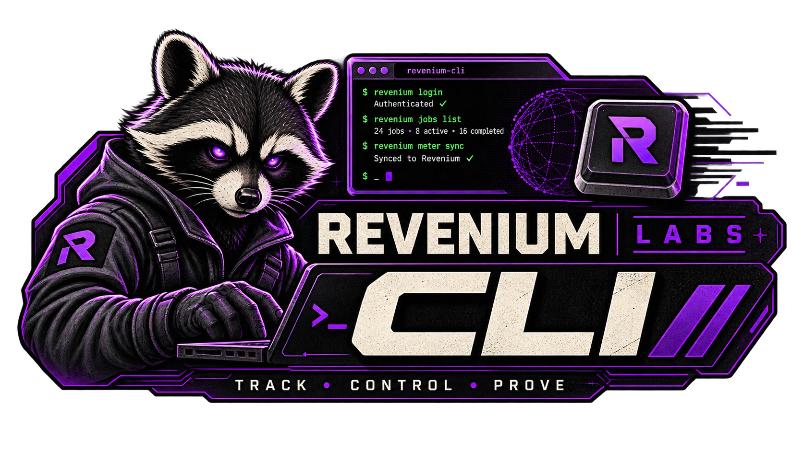

<div align="center">



</div>

# Revenium CLI

The official command-line interface for [Revenium](https://revenium.ai) — the AI Economic Control platform. Manage sources, models, subscriptions, alerts, metrics, agentic jobs, guardrails, and organizations from your terminal.


> ### 🧪 This is a Revenium Labs project
> **Revenium Labs** projects are field-developed, best-effort solutions. They are working,
> beta-quality software, built to solve real customer problems and shared in the open. They are
> **not** part of Revenium's officially supported products.
>
> - It works and solves a real problem, but may need adaptation to fit your exact environment.
> - It's provided as-is, without the versioned-release guarantees, SLAs, or formal support
>   that back our core products.
> - We welcome your issues, feedback, and PRs, and **we're happy to work with you** to make it
>   fit your use case. [Come talk to us on Discord](https://discord.gg/J2DbmjZ2nA).
>
> → **[What is Revenium Labs?](https://github.com/revenium/.github/blob/main/LABS.md)**

## Installation

See [INSTALL.md](INSTALL.md) for detailed installation instructions.

**Quick install (macOS):**

```sh
brew install revenium/tap/revenium
```

**Quick install (from source):**

```sh
go install github.com/revenium/revenium-cli@latest
```

## Quick Start

```sh
# 1. Set your API key (from https://app.revenium.ai)
revenium config set key your-api-key

# 2. Set your team ID
revenium config set team-id your-team-id

# 3. Verify configuration
revenium config show

# 4. Start using the CLI
revenium sources list
revenium models list
revenium metrics ai
```

## Configuration

The CLI stores configuration in `~/.config/revenium/config.yaml`.

| Key         | Description                          | Default                                |
|-------------|--------------------------------------|----------------------------------------|
| `key`       | Your Revenium API key                | *(required)*                           |
| `api-url`   | API base URL                         | `https://api.revenium.ai/profitstream` |
| `team-id`   | Team ID for multi-tenant access      | *(optional)*                           |
| `tenant-id` | Tenant ID                            | *(optional)*                           |
| `owner-id`  | Owner ID                             | *(optional)*                           |

```sh
revenium config set key your-api-key
revenium config set team-id your-team-id
revenium config set tenant-id your-tenant-id
revenium config set owner-id your-owner-id
revenium config set api-url https://custom.api.com/profitstream
revenium config show
```

### Global Override Flags

Five persistent flags are available on every subcommand and override the corresponding config value for a single invocation:

| Flag          | Overrides config key |
|---------------|----------------------|
| `--api-key`   | `key`                |
| `--api-url`   | `api-url`            |
| `--team-id`   | `team-id`            |
| `--tenant-id` | `tenant-id`          |
| `--owner-id`  | `owner-id`           |

```sh
# Run a single command against a different team
revenium sources list --team-id X

# Point one invocation at a dev environment
revenium sources list --api-url https://dev.api.example
```

> **Security note:** Passing `--api-key` on the command line exposes the key in your shell history and in process listings (e.g. `ps`). For sensitive use, prefer the `REVENIUM_API_KEY` environment variable or the config file (`revenium config set key`) instead.

### Environment Variables

Configuration can also be set via environment variables. The full resolution order is `flag > env var > config file > default`:

| Variable                | Overrides      |
|-------------------------|----------------|
| `REVENIUM_API_KEY`      | `key`          |
| `REVENIUM_API_URL`      | `api-url`      |
| `REVENIUM_TEAM_ID`      | `team-id`      |
| `REVENIUM_TENANT_ID`    | `tenant-id`    |
| `REVENIUM_OWNER_ID`     | `owner-id`     |
| `REVENIUM_OUTPUT_FORMAT` | `--output` flag (set to `json` or `table`) |

## Commands

### Core Resources

Manage the primary resources in your Revenium account. Most resource commands follow a consistent CRUD pattern: `list`, `get`, `create`, `update`, `delete`. Several groups also expose sub-resources (see the subsections below).

| Command           | Description                                              |
|-------------------|----------------------------------------------------------|
| `sources`         | Manage sources (APIs, AI services)                       |
| `models`          | Manage AI models and pricing dimensions                  |
| `products`        | Manage products                                          |
| `subscribers`     | Manage subscribers (incl. `lookup --email`)              |
| `subscriptions`   | Manage subscriptions                                     |
| `tools`           | Manage tools                                             |
| `teams`           | Manage teams and prompt capture settings                 |
| `users`           | Manage users (incl. `lookup --email`)                    |
| `anomalies`       | Manage AI anomaly detection rules                        |
| `alerts`          | Manage AI alerts and budget thresholds                   |
| `credentials`     | Manage provider credentials                              |
| `charts`          | Manage chart definitions                                 |
| `jobs`            | Manage Agentic Jobs (incl. outcome, ROI, transactions)   |
| `guardrails`      | Manage budget rules and view enforcement state           |
| `organizations`   | Manage organizations (incl. tags, child hierarchy)       |

**Examples:**

```sh
# List all AI models
revenium models list

# Get a specific source
revenium sources get vKab65

# Create a new product
revenium products create --name "Enterprise Plan" --description "Full access"

# Update a subscriber
revenium subscribers update sub-123 --first-name "Jane" --last-name "Doe"

# Delete a tool (with confirmation prompt)
revenium tools delete tool-456

# Delete without confirmation
revenium tools delete tool-456 --yes
```

#### Model Pricing

Manage pricing dimensions for AI models:

```sh
revenium models pricing list <model-id>
revenium models pricing create <model-id> --name "Input Tokens" --type TOKEN --price 0.003
revenium models pricing update <model-id> <dimension-id> --price 0.005
revenium models pricing delete <model-id> <dimension-id>
```

#### Budget Alerts

Track and manage AI spending budgets:

```sh
revenium alerts budget list
revenium alerts budget get <alert-id>
revenium alerts budget create <anomaly-id> --threshold 100.00
revenium alerts budget update <anomaly-id> --threshold 200.00
```

#### Team Prompt Capture

Configure prompt capture settings for a team:

```sh
revenium teams prompt-capture get <team-id>
revenium teams prompt-capture set <team-id> --enabled true
```

#### Team PR Health

View and update the PR health thresholds for a team. The API returns *effective* values with its own defaults already applied, and carries no provenance, so the CLI cannot tell a configured value from a server default and does not guess. Both flags on `set` are required, and the CLI refuses `--aging-days >= --rotting-days` before sending anything. The `--fields Value` shown below names a table column, not a response key — see Field Filtering under Output Formats for what that means when `--json` is also passed.

```sh
revenium teams pr-health get <team-id>
revenium teams pr-health get <team-id> --fields Value
revenium teams pr-health set <team-id> --aging-days 14 --rotting-days 30
```

#### Team Attribution Identity Policy

Read and set how a team's AI activity is attributed to an identity. The policy is one of two values: `VERIFIED_DOMAIN_ONLY`, which accepts only identities on a domain the tenant has verified, and `ALLOW_SELF_ASSERTED_UNVERIFIED`, which accepts any structurally valid identity. The value is compared exactly, so lowercase spellings are refused before anything is sent. The `--fields Value` shown below names a table column, not a response key — see Field Filtering under Output Formats for what that means when `--json` is also passed.

```sh
revenium teams attribution-identity-policy get <team-id>
revenium teams attribution-identity-policy get <team-id> --fields Value
revenium teams attribution-identity-policy set <team-id> --policy VERIFIED_DOMAIN_ONLY
revenium teams attribution-identity-policy set <team-id> --policy ALLOW_SELF_ASSERTED_UNVERIFIED
```

`set` prints an advisory on stderr before it sends the request, because the stored policy is currently recorded intent and is not enforced by the platform:

```
Note: this policy is recorded intent and is not currently enforced. While the platform's verified-domain gate is deactivated, attribution resolves every team to ALLOW_SELF_ASSERTED_UNVERIFIED and accepts structurally valid identities from any domain; structurally invalid addresses are rejected either way.
```

Storing `VERIFIED_DOMAIN_ONLY` therefore does not currently close anything, and a `200` echoing the strict value back is not evidence that it did. The notice is printed for both values rather than only the strict one, so it does not encode a guess about which platform gate is live today. It goes to **stderr** specifically so that `--json` output stays parseable — redirect stderr if a script should not see it. `get` prints no such notice: it reports a stored value and makes no claim about enforcement.

#### Team Verified Domains

List, add and remove the verified domains for a team's tenant.

```sh
revenium teams verified-domains list <team-id>
revenium teams verified-domains list <team-id> --fields Domain
revenium teams verified-domains add <team-id> acme.example
revenium teams verified-domains remove <team-id> acme.example
revenium teams verified-domains remove <team-id> acme.example --yes
revenium teams verified-domains remove <team-id> <domain> --json
```

The verbs are `list | add | remove` rather than the `get | set` pair the sibling settings groups use, because this endpoint is a collection rather than a scalar setting: `add` appends **one** domain and leaves the rest of the collection alone. Calling it `set` would suggest it replaces the collection, which it does not.

The domain travels exactly as you type it — no lowercasing, no trimming, no hostname format check. That matters most on `remove`, where the domain is matched against stored rows by the server: a client-side transform that disagreed with the server's would be a delete that quietly removed nothing while reporting success. If a removal returns a `404`, the domain as typed did not match a stored row.

`add` takes no `--source` or `--join-policy` flag — the platform assigns both — but it renders them back, so you can see the join policy attached to the domain you just verified. `list` and `add` share one `Domain | Source | Join Policy` table. An empty collection is a normal answer, not an error: `No verified domains found for this team.` in table mode, and `[]` under `--json`. The `--fields Domain` shown above names a table column, not a response key — see Field Filtering under Output Formats for what that means when `--json` is also passed.

`remove` goes through the same confirmation prompt every destructive command uses when it runs interactively, and `--yes` skips it. The prompt reads:

```
Delete verified domain acme.example? [y/N]
```

The verb in the prompt is `Delete` while the command is `remove`: the shared confirmation helper is reused unchanged, and it spells the word that way. `--dry-run` reports what would be sent and never prompts.

That shared helper skips the prompt in three cases: when `--yes` is passed, when `--json` is set, and when stdin is not a terminal. A piped or CI invocation therefore proceeds without prompting and deletes on the strength of the command line alone. This is inherited behaviour, shared by every destructive command in the CLI rather than specific to this one — pass `--yes` explicitly when you mean it, and do not rely on the prompt as a safety net in a non-interactive context.

Under `--json`, `remove` emits a JSON object in place of the prose sentence, carrying `removed`, `domain` and `teamId`, so a script can parse the result of a delete instead of string-matching a sentence:

```json
{ "removed": true, "domain": "acme.example", "teamId": "team-123" }
```

The document is the CLI's own — a `204` carries no body to relay — and it is emitted only after the delete succeeds. A failed delete relays the server's error and emits no success document.

#### Agentic Jobs

Manage Agentic Jobs and report their outcomes. Updates use PATCH semantics — only fields you pass are changed.

```sh
# Core CRUD
revenium jobs list
revenium jobs get <agenticJobId>
revenium jobs create --type <type> --status RUNNING
revenium jobs update <agenticJobId> --status COMPLETED
revenium jobs delete <agenticJobId>
revenium jobs delete <agenticJobId>...                     # two or more ids: one bulk request

# Sub-resources
revenium jobs outcome <agenticJobId> --outcome SUCCESS    # immutable; second call returns 409
revenium jobs roi <agenticJobId>                          # ROI metrics
revenium jobs roi-summary                                 # aggregate ROI summary across job types
revenium jobs transactions <agenticJobId>                 # AI transactions for the job
revenium jobs types                                       # available job types
revenium jobs conversion-funnel                           # aggregate conversion funnel
revenium jobs outcome-metrics <agenticJobId> --file <path>  # appends late per-job outcome metrics

# Job type economics and pre-AI baselines
revenium jobs types economics get <type>                  # declared contract + baseline in force
revenium jobs types economics set <type> --file <path>    # replaces the WHOLE document; --dry-run first
revenium jobs types baselines list <type>                 # every version ever declared, newest first
revenium jobs types baselines append <type>               # append-only; earlier versions never change
revenium jobs types facts append <type> --file <path>     # append-only; no way to fetch a fact afterwards
```

#### Guardrails

Manage cost-control budget rules and inspect runtime enforcement state.

```sh
# Budget rules (full CRUD; update uses PATCH)
revenium guardrails budget-rules list
revenium guardrails budget-rules get <id>
revenium guardrails budget-rules create --name "Daily $50" --threshold 50.00
revenium guardrails budget-rules update <id> --threshold 75.00
revenium guardrails budget-rules delete <id>

# Read-only enforcement state
revenium guardrails enforcement-rules get <team-id>       # compiled rules per team
revenium guardrails enforcement-events list               # audit trail of enforcement events

# Department scope preview - a POST that creates nothing
revenium guardrails org-unit-group-preview --parent-org-unit-id 40
revenium guardrails org-unit-group-preview --parent-org-unit-id 40 --json
```

`org-unit-group-preview` answers the question you ask *before* creating a department-scoped budget rule: how many direct sub-teams would such a rule independently cap? **It creates nothing.** It is a read that happens to be sent as a `POST`, so it carries no confirmation prompt and no `--dry-run` — there is nothing to confirm and nothing to preview. Creating the budget rule is a separate `revenium guardrails budget-rules create` call.

`--parent-org-unit-id` takes the **raw numeric org-unit id**, not a Revenium hashid. Org-unit ids are the one identifier in this API that is never hashed, so pasting a hashid here — the habit every other command trains — returns an error rather than a result.

The endpoint is inert unless both the `org-unit-budgets-enabled` and `org-unit-attribution-enabled` feature flags are enabled for the team, in which case it returns a `422`. The CLI does not pre-refuse the call, because it cannot see the flags' state; it names both flags in the error instead:

```
Request failed (HTTP 422): Department budgets not enabled for this team
This preview requires both the org-unit-budgets-enabled and org-unit-attribution-enabled feature flags to be enabled for this team. Contact Revenium support to enable them.
```

An org unit with no direct sub-teams is a real answer rather than an empty result, and reads as `This org unit has no direct sub-teams, so a department-scoped budget rule would cap nothing.` One caveat: `--fields` does not narrow this command's table output, because it renders two sections below a single output-mode branch and only the branch honours the filter; use `--json` when you need to select fields from this command.

#### Organizations

Manage organizations and navigate the parent/child hierarchy. Updates use PUT semantics (GET → merge → PUT) — the CLI handles the merge for you.

```sh
revenium organizations list
revenium organizations get <id>
revenium organizations create --name "Acme Corp"
revenium organizations update <id> --name "Acme Corporation"
revenium organizations delete <id>

# Sub-resources
revenium organizations tags <id>                          # view tags for an organization
revenium organizations children <id>                      # list direct child organizations
```

#### Lookups

Find resources by attribute instead of ID:

```sh
revenium subscribers lookup --email user@example.com
revenium users lookup --email user@example.com
revenium models lookup --name gpt-4
```

### Monitoring

Query metrics and analytics across your AI infrastructure.

```sh
# AI metrics (defaults to last 24 hours)
revenium metrics ai

# Completion metrics with custom time range
revenium metrics completions --from 2024-01-01T00:00:00Z --to 2024-01-31T23:59:59Z

# Other metric types
revenium metrics audio
revenium metrics image
revenium metrics video
revenium metrics traces
revenium metrics squads
revenium metrics api
revenium metrics tool-events
```

All metrics commands support `--from` and `--to` flags for filtering by time range (ISO 8601 format).

**Skill usage.**

```sh
# Skills ranked by attributed cost
revenium skills list

# Scope to a period
revenium skills list --period SEVEN_DAYS

# Full-fidelity JSON for scripting
revenium skills list --json

# One skill's usage detail
revenium skills get <skillId>
```

`skills` takes `--period` rather than the `--from`/`--to` range the metrics commands use. It accepts `HOUR`, `EIGHT_HOURS`, `TWENTY_FOUR_HOURS`, `SEVEN_DAYS`, `THIRTY_DAYS`, `NINETY_DAYS`, `SIX_MONTHS`, and `TWELVE_MONTHS`; omit the flag and the server applies its `THIRTY_DAYS` default.

These commands read back the skill attribution written by `meter completion --skill-*`. `--skill-invocation-trigger` is the one written field with no read-side counterpart in either response schema, so it can be recorded but not queried back.

### Sessions

Read which ticket a coding-assistant session is attributed to, and how that attribution changed over the life of the session.

```sh
# Every recorded attribution interval for a session
revenium sessions attribution <session-id>

# The intervals as a JSON array, including write provenance
revenium sessions attribution <session-id> --json
```

Intervals are listed **current first**, in the order the platform returns them — the API states that ordering as part of its contract, so the CLI does not re-sort and cannot reorder an interval away from the position the server guarantees. The first row is what the session is attributed to now.

The table carries four columns — `Effective From`, `Ticket`, `Title` and `Splits` — and those are the fields *every* caller receives. A response to a management-plane credential also carries write provenance (which API key wrote the attribution, who created and modified it, and the subscriber's email); a narrower metering-scoped credential is not sent those fields at all. Rather than show one caller four permanently blank columns, the table renders the fields common to both and `--json` emits the intervals as a JSON array carrying every field the caller's credential plane received — which is where a management-plane caller reads the provenance the table omits, so the four-column table stays lossless. That array is the same top-level type whether the session has intervals or none, so a script parses either state without branching on shape. The HAL collection envelope — the `_embedded` wrapper and the collection-level `_links` — is unwrapped rather than republished; this operation declares no pagination for those links to drive.

`Splits` is a count, not a list. An interval split across several tickets shows how many members it has — `3` — and an em dash when there is no split; the members, with their weights, are available under `--json`. A session with nothing recorded prints `No attribution intervals recorded for this session.`, which is an ordinary answer rather than an error.

### Metering

Submit usage events to Revenium's metering API for tracking and billing.

| Subcommand     | Description                              |
|----------------|------------------------------------------|
| `event`        | Meter a generic event with custom payload |
| `api-request`  | Meter an API request                     |
| `api-response` | Meter an API response                    |
| `completion`   | Meter an AI completion                   |
| `image`        | Meter an AI image operation              |
| `audio`        | Meter an AI audio operation              |
| `video`        | Meter an AI video operation              |
| `tool-event`   | Meter a tool/function call               |

**Examples:**

```sh
# Meter a generic usage event
revenium meter event --transaction-id txn-123 --payload '{"apiCalls": 100, "storageGB": 15.5}'

# Meter an AI completion
revenium meter completion --model gpt-4 --provider openai \
  --input-tokens 500 --output-tokens 200 --total-tokens 700 \
  --stop-reason END --is-streamed \
  --request-time 2024-01-15T10:00:00Z \
  --completion-start-time 2024-01-15T10:00:01Z \
  --response-time 2024-01-15T10:00:05Z \
  --request-duration 5000

# Meter a completion with prompt/response content
revenium meter completion --model gpt-4 --provider openai \
  --input-tokens 500 --output-tokens 200 --total-tokens 700 \
  --stop-reason END --is-streamed \
  --request-time 2024-01-15T10:00:00Z \
  --completion-start-time 2024-01-15T10:00:01Z \
  --response-time 2024-01-15T10:00:05Z \
  --request-duration 5000 \
  --system-prompt "You are a helpful assistant" \
  --input-messages '[{"role":"user","content":"Hello"}]' \
  --output-response "Hi there! How can I help you?"

# Meter an AI image generation
revenium meter image --model dall-e-3 --provider openai \
  --request-time 2024-01-15T10:00:00Z --response-time 2024-01-15T10:00:05Z \
  --request-duration 5000 --actual-image-count 1 --billing-unit PER_IMAGE

# Meter an API request/response pair
revenium meter api-request --transaction-id txn-456 --method POST --resource /api/users
revenium meter api-response --transaction-id txn-456 --response-code 200 --total-duration 150

# Meter an audio transcription
revenium meter audio --model whisper-1 --provider openai \
  --request-time 2024-01-15T10:00:00Z --response-time 2024-01-15T10:00:10Z \
  --request-duration 10000 --billing-unit PER_SECOND --duration-seconds 120

# Meter a video generation
revenium meter video --model veo --provider google \
  --request-time 2024-01-15T10:00:00Z --response-time 2024-01-15T10:01:00Z \
  --request-duration 60000 --duration-seconds 10 --billing-unit PER_SECOND

# Meter a tool call
revenium meter tool-event --tool-id search-api --duration-ms 150 --success \
  --timestamp 2024-01-15T10:00:00Z

# Preview a metering event without submitting
revenium meter completion --model gpt-4 --provider openai \
  --input-tokens 500 --output-tokens 200 --total-tokens 700 \
  --stop-reason END --is-streamed \
  --request-time 2024-01-15T10:00:00Z \
  --completion-start-time 2024-01-15T10:00:01Z \
  --response-time 2024-01-15T10:00:05Z \
  --request-duration 5000 --dry-run
```

All metering commands support optional fields for cost tracking (`--total-cost`), organizational attribution (`--agent`, `--environment`, `--organization-name`, `--product-name`), distributed tracing (`--transaction-id`, `--trace-id`, `--trace-type`), and conversation content (`--system-prompt`, `--input-messages`, `--output-response`). Use `revenium meter <subcommand> --help` for the full list of flags.

### Billing

`revenium billing` is a read-only cost-attribution and engineering-analytics surface on the platform host. Every verb honours the global `--team-id`, `--json`, `--fields` and `--quiet` flags documented earlier in this file.

**Seat utilization.**

`revenium billing seats` gets the daily Claude Enterprise seat utilization census.

| Flag     | Description                                        |
|----------|----------------------------------------------------|
| `--from` | First UTC day to return, inclusive (`yyyy-MM-dd`) — required |
| `--to`   | Last UTC day to return, inclusive (`yyyy-MM-dd`) — required  |

```sh
# Get daily seat utilization for a date range
revenium billing seats --from 2026-08-01 --to 2026-08-22

# Get the full response as JSON
revenium billing seats --from 2026-08-01 --to 2026-08-22 --json
```

This command requires a resolved team — set one with `--team-id`, `REVENIUM_TEAM_ID`, or `revenium config set team-id <id>`. A withheld count renders as a dash rather than a zero: the vendor withholds seat and invite figures for RBAC-scoped queries, and a withheld figure is not an organization that assigned no seats.

**PR health.**

`revenium billing vcs-pr-health` gets per-engineer PR health for a VCS source.

| Flag       | Description                                                    |
|------------|----------------------------------------------------------------|
| `--source` | VCS source: `github` or `gitlab` — required                     |
| `--from`   | Start date (ISO `yyyy-MM-dd`) of the closed/merged window — required |
| `--to`     | End date (ISO `yyyy-MM-dd`), inclusive — required               |

```sh
# Get PR health for GitHub over a date range
revenium billing vcs-pr-health --source github --from 2026-05-17 --to 2026-08-17

# Get the full response, including the oldest open-PR detail, as JSON
revenium billing vcs-pr-health --source github --from 2026-05-17 --to 2026-08-17 --json
```

Two things about this report are easy to get wrong. Aging and rotting classify open PRs by **inactivity** against the organization's own thresholds, not by age — a PR opened months ago but reviewed yesterday is neither. And the date range scopes the closed-without-merge counts only; the open-PR columns reflect the current synced state regardless of `--from` and `--to`. `--json` additionally carries the `oldest` open-PR detail list that the table summarises away.

**Merged PRs by department.**

`revenium billing vcs-prs-by-org-unit` gets the daily merged-PR series, optionally grouped by department.

| Flag                    | Description                                                                                  |
|-------------------------|----------------------------------------------------------------------------------------------|
| `--from`                | Start date (ISO `yyyy-MM-dd`) — required                                                      |
| `--to`                  | End date (ISO `yyyy-MM-dd`) — required                                                        |
| `--group-by`            | Return one row per (day, department) instead of the plain daily total; only `orgUnit` is supported by the server |
| `--org-unit-id`         | Scope the result to a single department, which must belong to the caller's organization       |
| `--include-descendants` | Also include the descendant departments of `--org-unit-id`; the server ignores this when `--org-unit-id` is omitted |

```sh
# Get the plain workspace daily total of merged PRs
revenium billing vcs-prs-by-org-unit --from 2026-03-15 --to 2026-04-14

# Break the same series down by department
revenium billing vcs-prs-by-org-unit --from 2026-03-15 --to 2026-04-14 --group-by orgUnit

# Scope to one department and its descendants
revenium billing vcs-prs-by-org-unit --from 2026-03-15 --to 2026-04-14 \
  --group-by orgUnit --org-unit-id 4821 --include-descendants

# Get the full response as JSON
revenium billing vcs-prs-by-org-unit --from 2026-03-15 --to 2026-04-14 --json
```

The server caps a request at 35 days and rejects a wider range. Users who resolve to no department are not dropped — they appear under the server's own `Unassigned` label, so grouped totals reconcile against the ungrouped total.

**Deprecated.**

Two billing commands target endpoints that have been withdrawn upstream. Both still work and both print a notice on **stderr**; stdout is unaffected, so `--json` pipelines are safe.

| Command                                    | Successor                                                                                    |
|--------------------------------------------|----------------------------------------------------------------------------------------------|
| `revenium billing claude-code-contributions` | `revenium billing vcs-prs`                                                                    |
| `revenium billing users get <email>`         | `revenium billing users` for cost, or `revenium billing vcs-pr-health` for per-engineer activity |

`revenium billing users` (the list form) is not deprecated and emits no notice.

**Availability.** `revenium billing seats`, `revenium billing vcs-pr-health` and `revenium billing vcs-prs-by-org-unit` are present in the development platform API document and absent from the cached production document. Until the production API ships them, these three commands may return `404` against `api.revenium.ai`. That is expected, not a CLI defect — the commands were built against the dev specification deliberately.

## Output Formats

### Table (default)

Human-readable tables with styled borders, automatically sized to your terminal width.

### JSON

Use `--output json` (or the legacy `--json` flag) for machine-readable output, suitable for scripting and CI/CD pipelines:

```sh
revenium sources list --output json
```

```json
[
  {
    "id": "vKab65",
    "name": "Default",
    "type": "AI",
    "status": "active"
  }
]
```

You can also set the output format via environment variable to avoid passing the flag on every call:

```sh
export REVENIUM_OUTPUT_FORMAT=json
revenium sources list
```

**Resolution order:** `--json` flag > `--output` flag > `REVENIUM_OUTPUT_FORMAT` env > default `table`.

Pipe to `jq` for further processing:

```sh
revenium models list --output json | jq '.[].name'
```

### Field Filtering

Use `--fields` to limit the fields included in output. The flag is accepted in both modes, but the two modes match different vocabularies:

- **Table mode** — `--fields` names **column headers**, and matches them case-insensitively. `--fields Value` and `--fields value` select the same column.
- **JSON mode** — `--fields` names the raw response keys the API sends, and matches them case-sensitively. A payload carrying `agingDays` is selected by `--fields agingDays` and by nothing else.

A column header that is not also a response key therefore narrows the table but produces an **empty document** when combined with `--json`. `--fields Value` on `teams pr-health get` and on `teams attribution-identity-policy get`, and `--fields Domain` on `teams verified-domains list`, are all of that kind: each filters the table as you expect and each yields `{}` (or `[{}]`) under `--json`, because the response has no key spelled that way. Avoid pairing a column header with `--json` until the two vocabularies are unified — name the response key instead, or drop `--fields` and select with `jq`.

```sh
# Only return id and name in JSON output — both are response keys
revenium sources list --output json --fields id,name

# Filter table columns
revenium sources list --fields id,name,status
```

### Quiet Mode

Suppress non-error output with `--quiet` / `-q`. Useful in scripts where you only care about the exit code:

`--quiet` suppresses advisory captions, empty-state sentences and success lines as well as tables — a qualifier is never left standing without the payload it qualifies, so `teams pr-health get --quiet`, `teams verified-domains list --quiet`, `teams verified-domains remove --quiet` and `sessions attribution --quiet` print nothing at all. The one exception is `--quiet` combined with `--json`: the JSON document is still emitted, because suppressing a machine-readable result would leave the combination with no use. Errors go to stderr and are never suppressed.

```sh
revenium sources delete src-123 --yes --quiet
```

## Dry Run

Preview any mutation (create, update, delete) without executing it using `--dry-run`. This is useful for validating commands before they make changes:

```sh
# See what would be sent to the API without creating anything
revenium sources create --name "My API" --type API --dry-run

# Combine with --output json for structured preview
revenium sources create --name "My API" --type API --dry-run --output json
```

```json
{
  "dry_run": true,
  "action": "create",
  "resource": "source",
  "path": "/v2/api/sources",
  "body": {
    "name": "My API",
    "type": "API",
    "version": "1.0.0"
  }
}
```

## Schema Introspection

Dump the full CLI command tree as machine-readable JSON with `revenium schema`. This is useful for programmatic discovery by AI agents, scripts, and automation tools:

```sh
revenium schema
```

The output includes all commands with their flags (types, defaults, required markers), mutating annotations, and exit code definitions.

## Global Flags

| Flag            | Short | Description                                           |
|-----------------|-------|-------------------------------------------------------|
| `--output`      |       | Output format: `json` or `table` (default `table`)    |
| `--fields`      |       | Comma-separated list of fields to include in output   |
| `--dry-run`     |       | Preview the action without executing it                |
| `--verbose`     | `-v`  | Enable verbose output (shows HTTP requests/responses)  |
| `--quiet`       | `-q`  | Suppress non-error output                              |
| `--yes`         | `-y`  | Skip confirmation prompts                              |
| `--help`        | `-h`  | Help for any command                                   |

## Shell Completions

Tab completion is available for bash, zsh, and fish. If installed via Homebrew, completions are set up automatically.

For manual setup:

```sh
# Bash
revenium completion bash > /etc/bash_completion.d/revenium

# Zsh
revenium completion zsh > "${fpath[1]}/_revenium"

# Fish
revenium completion fish > ~/.config/fish/completions/revenium.fish
```

## Verbose Mode

Use `--verbose` / `-v` to see HTTP request and response details. API keys are automatically masked in verbose output.

```
$ revenium sources list -v
> GET https://api.revenium.ai/profitstream/v2/api/sources?teamId=abc123
> x-api-key: ****7f3f
< 200 OK
╭──────────┬───────────────┬───────┬──────────╮
│ ID       │ Name          │ Type  │ Status   │
...
```

## Error Handling

The CLI provides clear, actionable error messages:

- **Invalid API key** — prompts you to run `revenium config set key`
- **Access denied** — indicates insufficient permissions
- **Resource not found** — the requested resource doesn't exist
- **Server errors** — suggests retrying or contacting support
- **Network errors** — prompts you to check connectivity

### Exit Codes

The CLI uses semantic exit codes for scripting and automation:

| Code | Meaning                          |
|------|----------------------------------|
| 0    | Success                          |
| 1    | General / unknown error          |
| 2    | Authentication error (401/403)   |
| 3    | Resource not found (404)         |
| 4    | Validation error (400/422)       |
| 5    | Network / connection failure     |

```sh
revenium sources get nonexistent-id; echo $?
# 3
```

In JSON mode, errors are written to stderr as structured JSON including the exit code:

```json
{
  "error": "Resource not found",
  "status": 404,
  "exit_code": 3
}
```

### Input Validation

Resource IDs are validated before any API call is made. IDs containing control characters, query parameters (`?`, `&`, `#`), path traversal sequences (`../`), or percent-encoded values (`%xx`) are rejected with a clear error message.

## Building from Source

```sh
git clone https://github.com/revenium/revenium-cli.git
cd revenium-cli
make build           # injects version/commit/date metadata from git
./revenium version
```

`make build` is the canonical local build path — it sets the version, commit, and date `ldflags` from `git describe`. For a quick dev rebuild without metadata:

```sh
go build -o revenium .
```

To build with explicit version metadata:

```sh
go build -ldflags "-X github.com/revenium/revenium-cli/internal/build.Version=1.0.0" -o revenium .
```

Other useful Makefile targets: `make test`, `make test-race`, `make lint`, `make clean`, `make release-dry` (GoReleaser snapshot), `make release-check` (GoReleaser config validation).

## Running Tests

```sh
go test ./...
```

## Endpoint Coverage Audit

Internal maintenance tooling, not something you need to run to use the CLI. `make coverage-audit` fetches the published Revenium OpenAPI documents and reports every API operation the CLI has no command for, alongside the operations that are deliberately skipped and the reason each one is:

```sh
make coverage-audit           # revalidate the cached specs, then audit
make coverage-audit-offline   # audit the cache already on disk; no network
```

The same audit has a field dimension, which answers the narrower question: of the endpoints the CLI does call, which request-body properties and query parameters does it never set, and which keys does it send that no schema declares:

```sh
make field-audit              # revalidate, then emit the field rows as TSV
make field-audit-offline      # the same over the cache already on disk
make field-backtest           # prove the join still reproduces the known drift
scripts/ci/coverage-audit.sh --offline --field-report   # the rendered report
```

The three `make` targets emit seven fixed tab-separated columns so two runs can be compared with `comm`; `--field-report` is the rendered form, which names the command file every finding belongs to, separates spec-`required` properties from optional ones, and prints what each suppression rule removed. `make field-backtest` runs the field join over a `git archive` of the commit that preceded the known v1.4.0/v1.5.0 drift and asserts that exactly those rows closed and nothing opened.

Repeat runs revalidate rather than re-download: unchanged documents come back as a `304` and the cached copy is reused. The offline form makes no request at all, so it is the one to run while working through the report. Both fail closed — if the spec set cannot be established, no report is printed rather than a partial one.

The audit runs from the internal development repository and is not part of a release build.

## AI Agent Integration

For AI agents and automation tools, see [CONTEXT.md](CONTEXT.md) for a machine-oriented reference covering authentication, output modes, exit codes, dry-run usage, and `revenium schema` for programmatic command discovery.

## License

MIT
